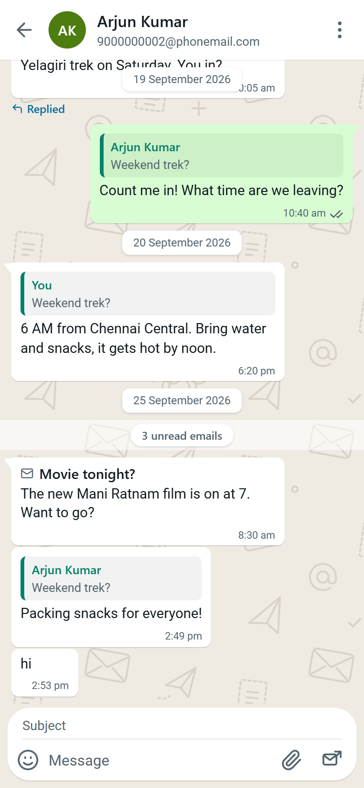
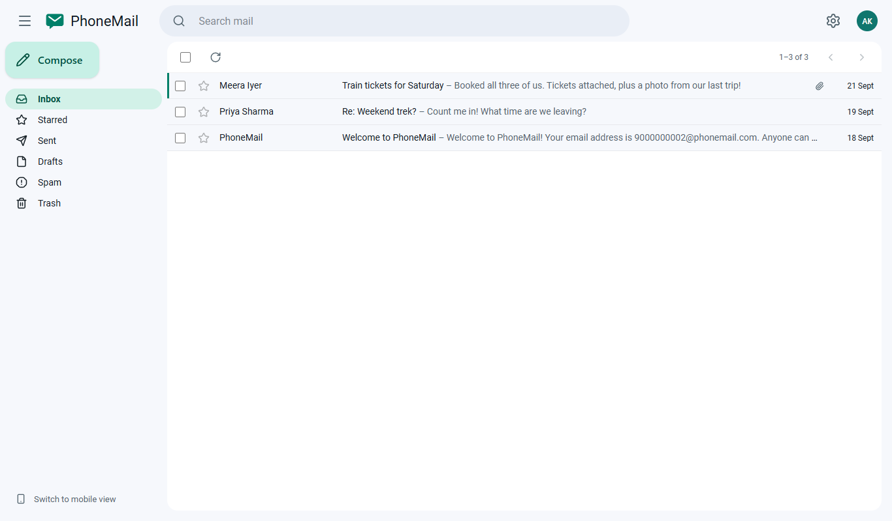
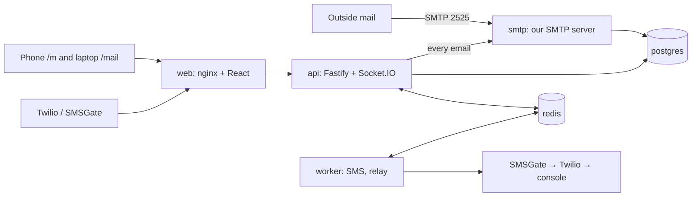

# PhoneMail

**Email where your phone number is your address:** `9876543210@phonemail.com`.

Sign up by calling a number and pressing 1, by texting JOIN, on a
registration portal, or in the apps. Read your mail as **WhatsApp-style chats
on your phone** or in a **Gmail-style inbox on your laptop**. If you don't use
the mobile app, an SMS tells you when an email arrives.

Built by Ashish Bharti for the AlphaStack 7-Day Buildathon, NIT Trichy.

<!--
  Screenshots (Ashish: save these three files, then remove this comment's
  opening and closing lines):
  
  
  
-->

## Quick start

You need Docker (Docker Desktop on Windows or macOS). Nothing else, and no
`.env`: it starts in demo mode with safe defaults.

```bash
docker compose up -d
```

The first run builds the images (a few minutes). Then:

| What | Where |
|---|---|
| The app (sends phones to /m, laptops to /mail) | http://localhost:8080 |
| Mobile client, WhatsApp style | http://localhost:8080/m |
| Web client, Gmail style (sign in at /login) | http://localhost:8080/mail |
| Registration portal | http://localhost:8080/register |
| Demo console: codes, SMS, call and text simulators | http://localhost:8080/demo |
| API docs (OpenAPI) | http://localhost:8080/api/docs |
| Mailpit: mail sent to outside addresses | http://localhost:8025 |
| SMTP server (send mail in from anywhere) | `localhost:2525` |

**Demo accounts** (seeded, with chats, a group, a draft, spam and more). Sign
in with the number; in demo mode the code appears on screen and in the demo
console:

| Number | Who | Notes |
|---|---|---|
| 9000000001 | Priya | Has the mobile app, so no SMS alerts |
| 9000000002 | Arjun | Web only, so gets SMS alerts; alias `arjun@phonemail.com` |
| 9000000003 | Meera | Signed up by phone call |

Or use any other number to create a new account.

Check the whole stack in one command (Git Bash on Windows):

```bash
./scripts/smoke.sh
```

Stop with `docker compose down` (add `-v` to delete the data too).

## Try the demo story

With the simulators, no phone needed (for real calls and texts, see
[docs/DEMO-DAY.md](docs/DEMO-DAY.md)):

1. **Sign up by phone call:** in the demo console, "Simulate call" and press
   1. The account is created and the confirmation SMS shows in the feed.
   (Or call the real Twilio number, see below.)
2. **Phone onboarding:** open `/m` in a phone-sized window: language, terms,
   number, code (auto-filled on Android), and you're in the chats.
3. **Web to phone:** sign in at `/mail` as another number and email the first
   one. It pops into the phone's chat instantly.
4. **Reply once:** swipe a bubble right to reply. Try again: it resists, and
   the server would refuse anyway.
5. **Groups:** email two people from Home: a group chat appears. A later
   email to just one of them goes to your 1:1 chat.
6. **SMS alert:** email Arjun (web only). The demo console shows "You have
   received an email from … Subject: …".
7. **Safe HTML:** demo console, "Send an email into PhoneMail", preset
   "Malicious HTML". Open it in full view: scripts don't run, remote images wait
   for "Show images".

## Features, and where to find them

| Requirement (task document) | Where |
|---|---|
| Sign up by calling and pressing 1 (IVR) | Twilio number or demo console "Simulate call"; `apps/server/src/modules/telephony` |
| Sign up by SMS | Text JOIN to the Twilio number or the SMSGate phone, or "Simulate SMS" |
| Registration portal: phone + OTP, fields reset for the next person | `/register` |
| Web client sign-in: one Next button, Terms line above it | `/login` |
| Mobile onboarding: language → terms → number (pre-filled, editable) → OTP (auto-detected) | `/m/welcome` |
| Permissions at the right moment (number, SMS code, contacts, notifications) | Onboarding and the first email |
| OTP login, password fallback (`AUTH_MODE=password`) | Both clients |
| Home: compose button bottom right, search a number to start a chat | `/m` |
| No Inbox/Sent on the phone: everything is chats | `/m` |
| Full-width search; chips All, Unread, Attachments, Favorites | `/m` |
| Menu: Home, Drafts, Spam, Trash; profile icon → settings | `/m` top bar |
| Settings: aliases, language, profile details, photo | `/m/settings` |
| Subject line for new emails, hidden when replying | Chat input |
| Same sender (aliases included) stays in one chat | Conversation keys, `modules/conversations` |
| Swipe to reply, replies linked to the original, reply only once | Chat screen (long-press has the same actions) |
| Long emails open in a traditional view with Reply at the bottom | "Read more" → `/m/read/…` |
| Full-view compose from a chat, recipients locked | "Write in full view" |
| 2+ recipients from Home make a group chat | Composer from Home |
| Gmail-like web client: list, reading, compose, folders, search, settings | `/mail` |
| SMS alerts only for people without the mobile app | Demo console feed; `modules/notifications` |
| Real SMTP server; mail between users; outside mail comes in over SMTP | `smtp` container, port 2525 |
| Everything in Docker, `docker compose up -d` | `docker-compose.yml` |

Also: Hindi and Tamil everywhere, live updates and blue ticks, drafts that
save themselves, stars, spam and blocked senders, attachments, aliases,
keyboard shortcuts on the web (press `?`), an installable PWA, and an
Android APK of the mobile app (a Trusted Web Activity; see
[docs/APK.md](docs/APK.md)).

## How it works



Every email, from our own apps or from outside, goes through the same SMTP
server and the same ingest pipeline. It is stored once, with one mailbox
entry per person. The phone groups entries into chats by *who is in them*;
the web groups the same entries into threads and folders. More diagrams,
including sending, IVR sign-up and the SMS rule:
[docs/ARCHITECTURE.md](docs/ARCHITECTURE.md).

## Design decisions

Every place the task was ambiguous, and what we chose, is written down in
[docs/DECISIONS.md](docs/DECISIONS.md). A few that shape the product:

- **A chat is a set of people.** Emails to the same people always land in the
  same chat, which is why you can't add someone inside a chat (start a new
  email instead).
- **The server enforces every rule** (reply once, locked recipients, who gets
  SMS, alias names). The apps only mirror them.
- **Every provider has a free fallback.** Without credentials, SMS and codes
  go to the demo console, so the whole product works offline.
- **One web app, two designs.** `/m` follows WhatsApp; `/mail` follows Gmail.
  They share the API, the composer, the email viewer and the settings.

## Security

OTP codes stored as keyed hashes with expiry, attempt and rate limits;
rotating refresh tokens with theft detection; CSRF header; zod on every input;
sanitized email HTML in a sandboxed, script-free frame with remote images
blocked; sniffed attachment types; no open relay; signed webhooks; non-root
containers. Details and known limits: [docs/SECURITY.md](docs/SECURITY.md).

## Accessibility

Keyboard access everywhere (Gmail shortcuts on the web), a long-press or
button alternative for every swipe, labelled icon buttons, focus-trapping
dialogs, new emails announced to screen readers, spoken ticks, reduced motion
respected, and every colour pair checked for WCAG AA contrast by
`scripts/check-contrast.mjs` in CI. English, हिन्दी and தமிழ்.

## Enable real calls and SMS (optional)

Everything works without this: in demo mode, codes and SMS appear in the demo
console, and the console simulates calls and texts. For the real thing:

### 1. A public HTTPS address (for Twilio, SMSGate and your phone)

```bash
./scripts/public-url.sh
```

The script starts a tunnel, saves its address as `PUBLIC_BASE_URL` in `.env`,
restarts the services, and (when configured) points Twilio and SMSGate at it.
Open `<that address>/m` on your phone. The script picks the first tunnel
that is set up in `.env` (or name one: `./scripts/public-url.sh ngrok`):

- **Tailscale Funnel** (free account, recommended): a fixed
  `https://phonemail.<tailnet>.ts.net` address over port 443, with nothing in
  front of the app. Sign up at tailscale.com; on the DNS page enable MagicDNS
  and HTTPS certificates; under Settings → Keys generate an auth key
  (Reusable on, Ephemeral off) and put it in `.env` as `TS_AUTHKEY`.
- **ngrok** (free account): also a fixed address over port 443, but browsers
  first see ngrok's "You are about to visit" page (click **Visit Site** once).
  Put `NGROK_AUTHTOKEN` and `NGROK_DOMAIN` (like `name.ngrok-free.dev`) in
  `.env`.
- **Cloudflare quick tunnel** (no account): a new `https://….trycloudflare.com`
  address on every start, so run the script again after each restart. It
  needs outgoing port 7844, which some networks block.

### 2. Twilio (phone call sign-up, SMS alerts)

1. Sign up for a free trial at twilio.com and verify your own mobile number
   (trial accounts can only call and text verified numbers, up to 5).
2. Get a phone number. Choose a **US local number**, not toll-free: US
   toll-free numbers can't be dialled from India.
3. Put these in `.env` (copy `.env.example`):
   `TWILIO_ACCOUNT_SID`, `TWILIO_AUTH_TOKEN`, `TWILIO_PHONE_NUMBER`.
4. Run `./scripts/public-url.sh` again: it sets the number's call and SMS
   webhooks for you. (By hand: in the Twilio console, set "A call comes in" to
   `<public address>/webhooks/twilio/voice` and "A message comes in" to
   `<public address>/webhooks/twilio/sms`, both HTTP POST.)
5. Call the number and press 1, or use **Call me** in the demo console to
   have Twilio call you (no international call charges). Trial calls start
   with a short Twilio notice.

Trial limits: Twilio's trial can only send its ready-made SMS templates, so
alerts arrive as a Twilio template (the organizers allow this) and sign-in
codes don't travel through Twilio. That's what SMSGate is for.

### 3. SMSGate (your Android phone as the SMS gateway: real codes, exact alert text)

1. Install **SMS Gateway for Android** (sms-gate.app) on an Android phone
   with a SIM, open it, turn on **Cloud server**, and note the username and
   password it shows. In Google Messages on that phone, turn **RCS chats**
   off: chat messages travel over the internet and never reach an SMS
   gateway. People texting the phone change nothing; their phones fall back
   to SMS. Allow the app to run in the background (battery settings), or
   phones like OPPO and Xiaomi pause it and texts stop being forwarded.
2. Put `SMSGATE_USERNAME` and `SMSGATE_PASSWORD` in `.env`, and run
   `./scripts/public-url.sh`. It registers the webhook for incoming texts.
3. Now sign-in codes arrive by real SMS (Chrome on Android fills them in
   automatically), SMS alerts use the task's exact text, and texting
   **JOIN** to the phone creates an account.

Using your personal phone is fine. Texts go out from your SIM (normal SMS
charges and daily limits apply), and while the webhook is registered the
phone forwards every text it receives. PhoneMail only acts on texts that start
with JOIN (or HELP) from real phone numbers, and never stores the others.
The demo accounts and the tests use made-up +91 9000 xxxxxx numbers, which
PhoneMail never texts for real in demo mode. Remove the webhook after the demo:

```bash
docker compose exec api node dist/scripts/smsgate-webhook.js unregister
```

## Tech stack, and why

| Part | Choice | Why |
|---|---|---|
| Backend | Node.js 24, TypeScript, Fastify | Fast, typed end to end, OpenAPI from the same zod schemas |
| Mail | smtp-server, mailparser, nodemailer, sanitize-html | A real SMTP server, not a fake inbox |
| Data | PostgreSQL 16 (Prisma), full-text search | One store for mail, chats and search |
| Jobs and live updates | Redis 7, BullMQ, Socket.IO | SMS and relay retry in the background; bubbles appear instantly |
| Telephony | Twilio (IVR, SMS), SMSGate (Android as SMS gateway) | Real calls on a free trial; exact SMS text for free |
| Frontend | React 19, Vite, Tailwind CSS 4, TanStack Query, Motion | One codebase, two designs, gestures |
| i18n | i18next (en, hi, ta) | Indian users first |
| Quality | Vitest, ESLint, Prettier, GitHub Actions | Rules are unit-tested; CI runs the whole stack |

## Project structure

```
apps/server       API, SMTP server and worker (one codebase, three entry points)
apps/web          the React app: /m (mobile), /mail + /login (web), /register, /demo
packages/shared   zod schemas and types used by both
scripts/          smoke test, contrast check, public URL helper
docs/             architecture, decisions, security, spec, learning notes
```

## Tests and CI

```bash
npm install
npm run typecheck && npm run lint && npm test   # 201 server + 22 web unit tests
node scripts/check-contrast.mjs                  # WCAG contrast of every colour pair
npm run test:integration -w apps/server          # against a running stack
./scripts/smoke.sh                               # against a running stack
```

GitHub Actions runs the checks above, `npm audit`, and then starts the full
stack with `docker compose up` (no `.env`) and runs the smoke test and the
integration tests against it (`.github/workflows/ci.yml`).

Local development without Docker for the web app: `npm run dev -w apps/web`
(port 5173, forwards `/api` to `localhost:3000`).

## Troubleshooting

- **`npm ci` fails inside Docker with a missing native module** (for example
  `@rollup/rollup-linux-x64-gnu`): the lockfile was made on another OS.
  Regenerate it on Linux:
  `docker run --rm -v "$PWD":/app -w /app node:24-slim npm install --package-lock-only`
- **Port 8080, 8025 or 2525 is busy:** stop the other program, or change the
  left side of the port mapping in `docker-compose.yml`.
- **"Too many requests" while testing sign-in:** everything from your laptop
  reaches Docker from one IP. Set `OTP_IP_LIMIT_PER_HOUR=1000` in `.env` and
  run `docker compose up -d` again.
- **Something is off:** `docker compose ps` and `docker compose logs api`.

## Documentation

- [docs/ARCHITECTURE.md](docs/ARCHITECTURE.md): containers and flows, with diagrams
- [docs/DECISIONS.md](docs/DECISIONS.md): how unclear requirements were resolved
- [docs/SECURITY.md](docs/SECURITY.md): every security measure and its limits
- [docs/CHECKLIST.md](docs/CHECKLIST.md): the final acceptance checklist and how each item was verified
- [docs/LEARNING.md](docs/LEARNING.md): plain-English notes on how it all works
- [docs/spec/](docs/spec/): the full specification
