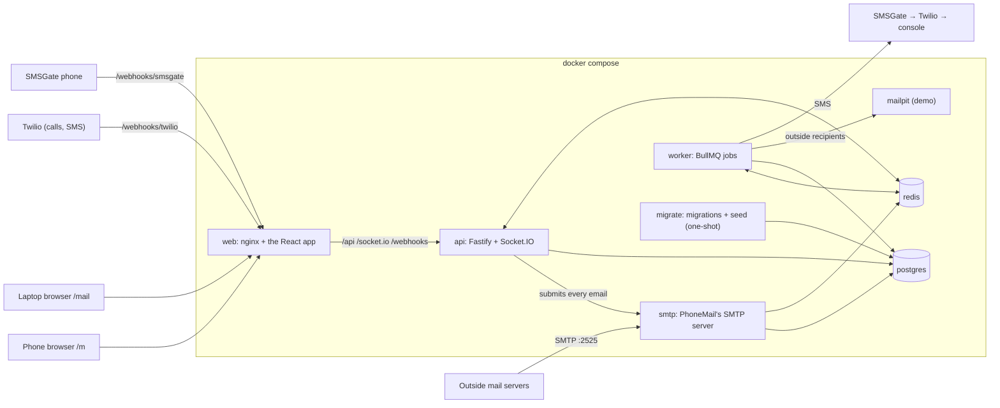
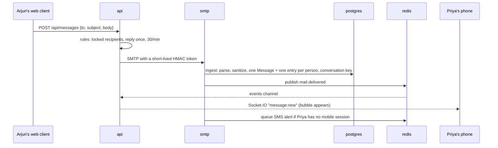
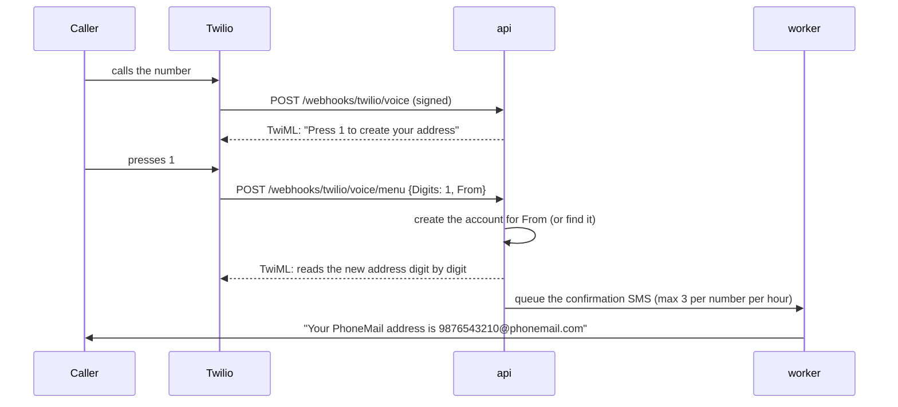
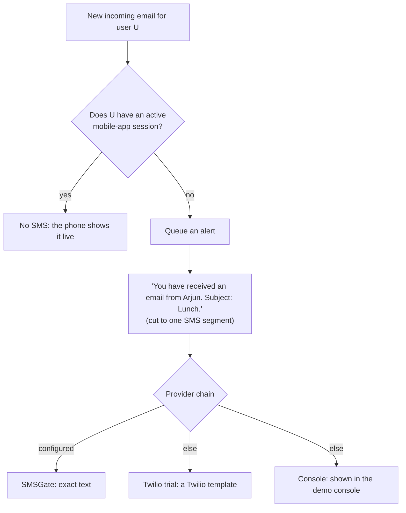

# How PhoneMail is built

One server codebase with three entry points (API, SMTP, worker), one React
app with two very different faces (mobile and web), and Postgres and Redis.
Everything runs with `docker compose up -d`.

## Containers



- **api** answers the apps, runs the IVR and SMS webhooks, and pushes live
  events to browsers over Socket.IO.
- **smtp** is the only way mail gets in, whether it comes from outside or
  from our own apps, so every email goes through one ingest pipeline.
- **worker** sends SMS alerts and sign-up texts, relays mail to outside
  addresses, and cleans up.
- **redis** holds OTP hashes, rate-limit counters, job queues and the
  `events` channel that carries live updates from any process to the api.

## Sending an email (app to app)



The conversation key is the set of people in the email (minus you), so
the same people always land in the same chat, whoever wrote first and from
whichever client.

## Mail from outside

```mermaid
sequenceDiagram
  participant O as outside@example.com
  participant S as smtp
  participant DB as postgres
  O->>S: RCPT TO 9876543210@phonemail.com
  S->>S: local domain and a real user? (otherwise 550, no open relay)
  O->>S: DATA (up to 25 MB)
  S->>DB: same ingest pipeline, spam score, blocked senders go to Spam
```



## Sign-up by phone call (IVR)



Texting JOIN to the Twilio number or the SMSGate phone does the same through
`/webhooks/twilio/sms` and `/webhooks/smsgate/<secret>`.

## Who gets an SMS alert?



## Where things are

```
apps/server/src
  entry/        api.ts, smtp.ts, worker.ts, migrate-and-seed.ts
  modules/      auth, accounts, users, aliases, mail, smtp, mailbox,
                conversations, notifications, telephony, realtime, demo, portal
  providers/    sms (smsgate, twilio, console), otp
apps/web/src
  mobile/       the WhatsApp-style client (/m)
  web/          the Gmail-style client (/mail) and /login
  portal/       /register     demo/  /demo     shared/  api client, i18n, helpers
packages/shared zod schemas and types used by both sides
```

The API is described by OpenAPI at `/api/docs` (every route declares its
body, query, params and responses with zod).
